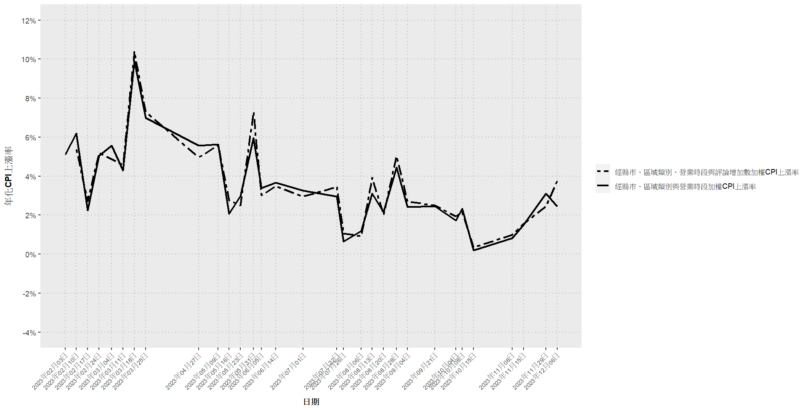

# Thesis

- [1 第一章、緒論](#第一章緒論)
- [2
  第二章、文獻回顧](#第二章文獻回顧)
- [3
  第三章、資料處理與觀察](#第三章資料處理與觀察)
  - [3.1
    第一節、資料介紹](#第一節資料介紹)
  - [3.2
    第二節、資料處理](#第二節資料處理)
  - [3.3
    第三節、資料觀察與分析](#第三節資料觀察與分析)
- [4
  第四章、外食物價計算方法](#第四章外食物價計算方法)
  - [4.1
    第一節、商家權重](#第一節商家權重)
    - [4.1.1
      1.經縣市加權](#經縣市加權)
    - [4.1.2
      2.經區域類別加權](#經區域類別加權)
    - [4.1.3
      3.經營業時段加權](#經營業時段加權)
    - [4.1.4
      4.經縣市及區域類別加權](#經縣市及區域類別加權)
    - [4.1.5
      5.經縣市及營業時段加權](#經縣市及營業時段加權)
    - [4.1.6
      6.經區域類別及營業時段加權](#經區域類別及營業時段加權)
    - [4.1.7
      7.經縣市、區域類別及營業時段加權](#經縣市區域類別及營業時段加權)
  - [4.2
    第二節、加入消費者權重](#第二節加入消費者權重)
- [5
  第五章、實證分析](#第五章實證分析)
  - [5.1
    第一節、外送平台物價變動情況的分析](#第一節外送平台物價變動情況的分析)
  - [5.2
    第二節、外送平台物價指數與政府主計處的物價指數比較](#第二節外送平台物價指數與政府主計處的物價指數比較)
- [6 第六章、結論](#第六章結論)

# 第一章、緒論

根據主計處網站，消費者物價指數的編製目的為衡量臺灣地區家庭購買消費性商品及服務之價格水準變動情形。可以用來評估通貨膨脹的狀況，並作為薪資調整的參考、稅負徵收的依據。主計處除了編算總指數外，又下分食物類、衣著類、居住類、交通及通訊類、醫療保健類、教養娛樂類及雜項類等7個大類、40
個中類及 62
個小類之分類指數，查價項目涵蓋了368個項目群。依據110年基期消費者物價指數查價項目之權數，7大類中的權數分別為食物類267.53‰、衣著類55.25‰、居住類227.71‰、交通及通訊類144.71‰、醫療保健類47.37‰、教養娛樂類132.46‰、雜項類124.97‰。當中又以食物類的比重最高，由於飲食是人們日常生活中必不可少的支出項目，因此食物價格的變動對民眾的生活影響甚鉅。

然而，儘管消費者物價指數提供了重要的參考資訊，每月的消費者物價指數皆在次月五日後由主計處發布，可能無法及時了解市場的變化。隨著新冠疫情爆發與人們消費習慣的改變，帶動了外送平台的興起。根據資策會產業情報研究所發布外送平台大調查顯示，2023年民眾最常用的外送平台為foodpanda，有將近73.6%的民眾使用過平台。這顯示了foodpanda在台灣的重要性，不僅提供了便捷的外送服務，更成為了民眾日常生活中不可或缺的購買外食管道。因此，本文將利用foodpanda上的價格資料計算物價變化，並以不同面向切入計算權數。以此與主計處的計算方法有所不同，旨在建立一個更具代表性、資料更新頻率更高的外送平台物價指數。

# 第二章、文獻回顧

消費者物價指數（CPI）的編製和計算一直是各國政府關注的重要課題，作為通貨膨脹的衡量指標，其準確性對於政策制定及評估有深遠影響。然而，Costa(2001)的研究發現，估算的CPI與實際支出調查數據之間存在差距，這表明CPI的計算可能存在偏差。例如，該研究使用了1972年至1994年的食品和娛樂支出數據，發現這段期間平均年偏差為1.6％。這些發現凸顯了在CPI計算中需要更全面考慮現實消費環境的重要性。

各國計算CPI時會遇到一些共同的問題，其中包括Bradley,R(2001)
指出的樣本偏誤。在CPI的編製過程中，樣本偏誤被認為是一個主要問題。這是因為樣本的選取可能存在偏差，導致CPI無法完全代表整個消費者群體的消費行為。其次是替代性偏誤，Marilyn
E. Manser和Richard J.
McDonald(1988)在文中探討了消費者行為的變化。當計算通貨膨脹時，未考慮到商品價格上升，消費者可能改選擇較便宜的方式替代，可能會導致通膨被高估。Boskin
Commission(1996)中也提到了新商品已廣泛出現，卻在多年後才被納入CPI的新商品偏誤；以及當某個商品的品質提高，卻因為價格沒有調整而無法反映在CPI裡的品質偏誤。

為了降低偏誤的程度，本文將著重在樣本偏誤及替代性偏誤。首先，將利用各個面向的權數調整，包含店家所在地區、店家販售餐飲類型及店家營業時段，來確保所選樣本足以代表目標母體，從而提高CPI的代表性和準確性。其次，將透過foodpanda上店家顧客的評論數來調整計算物價上漲率的方式，以更真實地反映消費者的偏好和行為。

# 第三章、資料處理與觀察

## 第一節、資料介紹

本文將利用foodpanda上店家的店名、店家菜單品項與價格、店家熱門商品、店家所在縣市、店家類別、供餐時段及評論數來進行各面向的分析，涵蓋的日期包含2023年2月3日、2023年2月10日、2023年2月17日、2023年2月24日、2023年3月4日、2023年3月11日、2023年3月18日、2023年3月25日、2023年4月27日、2023年5月9日、2023年5月16日、2023年5月23日、2023年5月31日、2023年6月5日、2023年6月14日、2023年7月1日、2023年7月22日、2023年7月26日、2023年8月6日、2023年8月13日、2023年8月20日、2023年8月28日、2023年9月4日、2023年9月21日、2023年10月4日、2023年10月8日、2023年10月15日、2023年11月8日、2023年11月15日、2023年11月29日、2023年12月6日、2023年12月13日，總共32天的資料。

## 第二節、資料處理

建立消費者物價指數（CPI）時，必須確保所選取的樣本能夠真實反映消費者的購買行為。然而，每個店家提供的菜單可能並非所有商品都是消費者常購買的。因此，本文在2023年8月6日特別抓取了各店家統計出的六項人氣精選商品，這些商品被認為更具代表性，並以這天作為基準期，有助於建構更準確的平台CPI。

為了確保選取的店家和商品能夠有效地代表消費者的購買行為，此處設定了兩項原則。首先，選取的店家必須同時存在於當期和基準期（2023年8月6日）。其次，選取的店家菜單在當期必須包含基準期的六項人氣精選商品，且在下一期菜單也必須包含這六項人氣精選商品。

除了符合上述兩項原則的店家以外，也進一步篩選出銷售正餐的店家。這是因為正餐店家更能夠直接影響民生餐飲成本，相較於僅販售點心或飲料的店家，正餐店家的商品更具有代表性。這一步驟的加入有助於確保選取的樣本更加符合實際消費情況，從而提高CPI的準確性和可靠性。

## 第三節、資料觀察與分析

根據foodapnda上所篩選出的各期樣本店家，首先計算每一期六項人氣精選商品的價格加總，而個別店家當期的CPI上漲率=ln(下一期價格)-ln(當期價格)，再將當期所有店家的CPI上漲率取平均得到當期的CPI上漲率。然而，因為每一期間隔的天數不同，將利用(當期的CPI上漲率/間隔天數)\*365得到年均CPI上漲率，以利各期之間的比較。

| 日期           | CPI上漲率 | 間隔天數 | 日均CPI上漲率 | 年均CPI上漲率 |
|:---------------|:----------|---------:|:--------------|:--------------|
| 2023年02月03日 | 0.1051%   |        7 | 0.0150%       | 5.4812%       |
| 2023年02月10日 | 0.1061%   |        7 | 0.0152%       | 5.5326%       |
| 2023年02月17日 | 0.0505%   |        7 | 0.0072%       | 2.6344%       |
| 2023年02月24日 | 0.1066%   |        8 | 0.0133%       | 4.8659%       |
| 2023年03月04日 | 0.0984%   |        7 | 0.0141%       | 5.1315%       |
| 2023年03月11日 | 0.0847%   |        7 | 0.0121%       | 4.4145%       |
| 2023年03月18日 | 0.1913%   |        7 | 0.0273%       | 9.9762%       |
| 2023年03月25日 | 0.6527%   |       33 | 0.0198%       | 7.2191%       |
| 2023年04月27日 | 0.1685%   |       12 | 0.0140%       | 5.1264%       |
| 2023年05月09日 | 0.1097%   |        7 | 0.0157%       | 5.7226%       |
| 2023年05月16日 | 0.0475%   |        7 | 0.0068%       | 2.4794%       |
| 2023年05月23日 | 0.0564%   |        8 | 0.0070%       | 2.5712%       |
| 2023年05月31日 | 0.0930%   |        5 | 0.0186%       | 6.7868%       |
| 2023年06月05日 | 0.0773%   |        9 | 0.0086%       | 3.1352%       |
| 2023年06月14日 | 0.1626%   |       17 | 0.0096%       | 3.4904%       |
| 2023年07月01日 | 0.1808%   |       21 | 0.0086%       | 3.1420%       |
| 2023年07月22日 | 0.0366%   |        4 | 0.0092%       | 3.3416%       |
| 2023年07月26日 | 0.0348%   |       11 | 0.0032%       | 1.1558%       |
| 2023年08月06日 | 0.0247%   |        7 | 0.0035%       | 1.2860%       |
| 2023年08月13日 | 0.0689%   |        7 | 0.0098%       | 3.5933%       |
| 2023年08月20日 | 0.0467%   |        8 | 0.0058%       | 2.1290%       |
| 2023年08月28日 | 0.0811%   |        7 | 0.0116%       | 4.2285%       |
| 2023年09月04日 | 0.1240%   |       17 | 0.0073%       | 2.6615%       |
| 2023年09月21日 | 0.0886%   |       13 | 0.0068%       | 2.4877%       |
| 2023年10月04日 | 0.0199%   |        4 | 0.0050%       | 1.8127%       |
| 2023年10月08日 | 0.0411%   |        7 | 0.0059%       | 2.1455%       |
| 2023年10月15日 | 0.0201%   |       24 | 0.0008%       | 0.3052%       |
| 2023年11月08日 | 0.0182%   |        7 | 0.0026%       | 0.9470%       |
| 2023年11月15日 | 0.0554%   |       14 | 0.0040%       | 1.4451%       |
| 2023年11月29日 | 0.0463%   |        7 | 0.0066%       | 2.4161%       |
| 2023年12月06日 | 0.0610%   |        7 | 0.0087%       | 3.1800%       |

從圖中可以明顯看出，2023年的2月到3月這段期間CPI上漲率的波動較大，2023年3月18日這天甚至高達9.9762%，這可能和原物料價格上漲有關。而後續有放緩的趨勢，但在5月31日這天又上升至6.7868%。以5月31日為分水嶺，在這之後的CPI上漲率相對穩定，普遍皆維持在4%以下的水準。

外送平台的價格波動，除了來自商家自行調整售價外，還有可能來自於平台不定期的銷售折扣與推出的優惠活動。這些來自促銷活動的折扣雖然會影響CPI的計算，但實際上也提供更靈活、更及時的方式來反映市場在當期的狀況。CPI作為衡量消費者的購買力的指標，納入這些價格變化能使CPI更精確地體現消費者在實際生活的支出情況。

# 第四章、外食物價計算方法

## 第一節、商家權重

### 1.經縣市加權

為了解決樣本可能產生偏誤的問題，將在各期進行權重的調整，以還原2023年8月6日總共56545間店家的母體結構。根據2023年8月6日的縣市母體分配，台中市占15.54%、新北市14.91%、高雄市12.16%、台北市11.05%、桃園市10.43%、台南市8.25%、彰化縣4.76%、屏東縣2.90%、新竹縣2.58%、新竹市2.54%、宜蘭縣2.44%、雲林縣2.18%、嘉義市2.14%、苗栗縣2%、南投縣1.67%、花蓮縣1.63%、基隆市1.47%、嘉義縣0.76%及台東縣0.59%。

下表為各期所選的樣本店家所在縣市的占比，首先將根據店家所在的縣市進行加權處理，以確保每個縣市的樣本在分析中得到適當的代表性。

| 日期           | 臺中市   | 新北市   | 高雄市   | 臺北市   | 桃園市   | 臺南市  | 苗栗縣  | 彰化縣  | 新竹縣  | 屏東縣  | 宜蘭縣  | 新竹市  | 基隆市  | 花蓮縣  | 嘉義市  | 雲林縣  | 南投縣  | 嘉義縣  | 臺東縣  |
|:---------------|:---------|:---------|:---------|:---------|:---------|:--------|:--------|:--------|:--------|:--------|:--------|:--------|:--------|:--------|:--------|:--------|:--------|:--------|:--------|
| 2023年02月03日 | 15.9396% | 16.3049% | 13.2038% | 12.6663% | 8.9518%  | 8.0422% | 2.1639% | 4.1210% | 1.8813% | 1.8055% | 2.5842% | 2.6945% | 1.8331% | 1.5299% | 2.2948% | 1.9365% | 1.3714% | 0.6202% | 0.0551% |
| 2023年02月10日 | 16.0235% | 16.3367% | 13.2640% | 12.2242% | 8.8382%  | 8.2184% | 2.1662% | 4.2325% | 1.7996% | 1.8063% | 2.5395% | 2.7195% | 1.7730% | 1.6063% | 2.3995% | 1.9929% | 1.3331% | 0.6665% | 0.0600% |
| 2023年02月17日 | 16.2084% | 15.7995% | 13.3070% | 12.3772% | 8.9285%  | 8.2822% | 2.2024% | 4.2466% | 1.6881% | 1.7474% | 2.5519% | 2.6772% | 1.7409% | 1.7672% | 2.3277% | 2.0772% | 1.3782% | 0.6396% | 0.0528% |
| 2023年02月24日 | 16.2646% | 15.6465% | 13.3825% | 12.7347% | 9.2108%  | 8.2066% | 2.2047% | 4.2192% | 1.6580% | 1.7293% | 2.5434% | 2.6147% | 1.7293% | 1.8778% | 2.2879% | 2.1096% | 0.8914% | 0.6358% | 0.0535% |
| 2023年03月04日 | 16.3331% | 15.5870% | 13.5223% | 12.8398% | 9.1614%  | 8.1608% | 2.2209% | 4.2279% | 1.6368% | 1.7409% | 2.4639% | 2.5564% | 1.7004% | 1.8681% | 2.3308% | 2.0532% | 0.8907% | 0.6478% | 0.0578% |
| 2023年03月11日 | 16.4797% | 15.5441% | 13.1253% | 12.4342% | 9.1276%  | 8.4206% | 2.1955% | 4.0668% | 1.6427% | 1.7862% | 2.4401% | 2.6314% | 1.7596% | 1.8393% | 2.4294% | 1.9350% | 1.4194% | 0.6751% | 0.0478% |
| 2023年03月18日 | 16.3434% | 15.6321% | 13.1641% | 12.2750% | 9.0581%  | 8.6162% | 2.1339% | 4.1276% | 1.6219% | 1.7728% | 2.4787% | 2.6404% | 1.7998% | 1.7620% | 2.4733% | 1.9614% | 1.4226% | 0.6682% | 0.0485% |
| 2023年03月25日 | 16.3570% | 15.4415% | 13.0516% | 12.2842% | 9.0007%  | 8.7376% | 2.1543% | 4.1495% | 1.6006% | 1.7705% | 2.5160% | 2.6969% | 1.8199% | 1.6993% | 2.4503% | 2.1488% | 1.4142% | 0.6578% | 0.0493% |
| 2023年04月27日 | 16.3610% | 15.2455% | 13.1214% | 12.2912% | 9.0515%  | 8.8885% | 2.1292% | 4.0954% | 1.6147% | 1.7522% | 2.5876% | 2.7608% | 1.7675% | 1.6656% | 2.5367% | 2.0986% | 1.3498% | 0.6367% | 0.0458% |
| 2023年05月09日 | 17.0047% | 14.8527% | 13.5934% | 12.2000% | 7.9269%  | 9.1191% | 2.1675% | 4.0409% | 1.5534% | 1.7701% | 2.6733% | 2.7868% | 1.8166% | 1.7237% | 2.5391% | 2.1004% | 1.3831% | 0.6967% | 0.0516% |
| 2023年05月16日 | 15.8250% | 15.2205% | 12.4086% | 10.6434% | 8.9484%  | 8.2651% | 2.0980% | 5.1202% | 2.7463% | 2.9565% | 2.5754% | 2.3959% | 1.6075% | 1.5505% | 2.2820% | 2.1374% | 1.7783% | 0.8191% | 0.6220% |
| 2023年05月23日 | 15.8741% | 15.3368% | 12.2990% | 10.7548% | 8.7790%  | 8.3009% | 2.0604% | 5.0897% | 2.6950% | 2.9827% | 2.5723% | 2.4623% | 1.5950% | 1.5654% | 2.2804% | 2.1154% | 1.7981% | 0.8123% | 0.6262% |
| 2023年05月31日 | 15.9181% | 15.2357% | 12.2002% | 10.6452% | 8.7014%  | 8.3416% | 2.0637% | 5.0910% | 2.6758% | 3.0190% | 2.6179% | 2.4524% | 1.6294% | 1.6088% | 2.3201% | 2.2002% | 1.7866% | 0.8519% | 0.6410% |
| 2023年06月05日 | 15.9560% | 15.3525% | 12.3530% | 10.7601% | 8.6968%  | 8.3063% | 2.1609% | 4.9430% | 2.6712% | 2.9285% | 2.4937% | 2.6090% | 1.5486% | 1.5619% | 2.1520% | 2.2008% | 1.8192% | 0.8608% | 0.6256% |
| 2023年06月14日 | 15.9196% | 15.6876% | 12.4768% | 10.8296% | 8.6396%  | 8.2127% | 2.2504% | 4.8534% | 2.6308% | 3.0160% | 2.3617% | 2.4360% | 1.5915% | 1.6193% | 2.1669% | 2.2086% | 1.7307% | 0.7888% | 0.5800% |
| 2023年07月01日 | 15.7370% | 15.6740% | 12.4871% | 11.2060% | 9.2911%  | 8.1899% | 2.0992% | 4.5399% | 2.4992% | 3.0431% | 2.3778% | 2.4093% | 1.5238% | 1.6811% | 2.0767% | 2.1216% | 1.6721% | 0.7911% | 0.5799% |
| 2023年07月22日 | 15.7161% | 15.6092% | 12.1911% | 11.0741% | 9.5097%  | 8.1591% | 2.0635% | 4.6103% | 2.5586% | 3.0814% | 2.4358% | 2.4081% | 1.6001% | 1.7902% | 2.0833% | 2.1071% | 1.6952% | 0.7288% | 0.5783% |
| 2023年07月26日 | 15.9883% | 15.2287% | 12.0462% | 10.8468% | 9.4035%  | 8.1801% | 2.0750% | 4.6778% | 2.6107% | 3.0625% | 2.6147% | 2.5428% | 1.5393% | 1.6552% | 2.1150% | 2.2189% | 1.8351% | 0.7396% | 0.6197% |
| 2023年08月06日 | 14.0766% | 11.2511% | 19.6255% | 20.2723% | 0.0000%  | 5.7702% | 7.6596% | 4.5106% | 4.5277% | 0.0000% | 3.3872% | 3.0468% | 2.8936% | 0.0000% | 0.0000% | 0.0511% | 1.7872% | 1.1404% | 0.0000% |
| 2023年08月13日 | 14.2475% | 11.4782% | 19.4423% | 20.3209% | 0.0000%  | 5.8824% | 7.8877% | 4.6028% | 4.2399% | 0.0000% | 3.2086% | 3.0558% | 2.7120% | 0.0000% | 0.0000% | 0.0573% | 1.7571% | 1.1077% | 0.0000% |
| 2023年08月20日 | 15.9930% | 15.3625% | 12.3324% | 10.4691% | 9.1658%  | 7.8907% | 2.2679% | 5.0910% | 2.5973% | 3.1243% | 2.5455% | 2.3150% | 1.5810% | 1.7362% | 2.1738% | 2.1691% | 1.8256% | 0.7670% | 0.5929% |
| 2023年08月28日 | 16.0062% | 16.4438% | 11.4191% | 13.5505% | 9.8955%  | 8.4610% | 3.5578% | 4.6276% | 1.8883% | 3.6470% | 3.4525% | 0.4376% | 1.6776% | 2.5934% | 0.0162% | 1.9288% | 0.0000% | 0.3242% | 0.0729% |
| 2023年09月04日 | 16.1894% | 16.0171% | 11.6764% | 13.2518% | 10.1748% | 8.7142% | 3.4873% | 4.4884% | 1.8462% | 3.7581% | 3.3724% | 0.4103% | 1.6739% | 2.6011% | 0.0246% | 1.9201% | 0.0000% | 0.3282% | 0.0656% |
| 2023年09月21日 | 15.7358% | 14.9605% | 12.2996% | 9.9737%  | 10.6150% | 7.8679% | 2.1106% | 5.2453% | 2.6418% | 3.0342% | 2.4073% | 2.5413% | 1.5171% | 1.4740% | 2.2398% | 2.1249% | 1.7468% | 0.8710% | 0.5934% |
| 2023年10月04日 | 15.9288% | 14.6051% | 12.5031% | 9.7169%  | 10.4358% | 7.9867% | 2.0525% | 5.2799% | 2.6821% | 3.2869% | 2.4937% | 2.6870% | 1.4427% | 1.5071% | 2.1466% | 2.1962% | 1.6658% | 0.8725% | 0.5106% |
| 2023年10月08日 | 15.8645% | 14.8795% | 12.6075% | 9.7052%  | 10.5719% | 8.0767% | 1.9962% | 5.3122% | 2.6528% | 2.9812% | 2.5018% | 2.8236% | 1.5037% | 1.4380% | 2.0422% | 2.1275% | 1.7007% | 0.7814% | 0.4334% |
| 2023年10月15日 | 15.6926% | 14.6082% | 12.1367% | 9.8859%  | 10.8820% | 8.2214% | 1.9797% | 5.1888% | 2.7111% | 2.9695% | 2.5471% | 2.8561% | 1.5195% | 1.5321% | 2.0238% | 2.1688% | 1.7779% | 0.8133% | 0.4855% |
| 2023年11月08日 | 15.6386% | 14.9844% | 11.9315% | 10.0000% | 10.9782% | 8.1121% | 2.0748% | 5.2212% | 2.6978% | 2.9034% | 2.4237% | 2.6293% | 1.6199% | 1.4829% | 2.1308% | 2.0935% | 1.7695% | 0.8162% | 0.4922% |
| 2023年11月15日 | 15.4151% | 15.2359% | 12.0287% | 10.1018% | 10.9404% | 7.9060% | 2.1702% | 5.2750% | 2.6567% | 2.9063% | 2.4198% | 2.6183% | 1.6388% | 1.5108% | 2.0357% | 2.0869% | 1.7092% | 0.8258% | 0.5185% |
| 2023年11月29日 | 15.3837% | 16.7532% | 10.1653% | 12.4203% | 12.2078% | 7.1429% | 2.1488% | 5.2066% | 2.8335% | 2.2668% | 2.1724% | 2.7273% | 1.5939% | 1.3932% | 1.6411% | 1.7710% | 1.2869% | 0.5313% | 0.3542% |
| 2023年12月06日 | 15.3475% | 16.1694% | 10.2555% | 13.2571% | 12.5960% | 7.1467% | 1.8581% | 5.2528% | 3.0195% | 2.3584% | 2.0189% | 2.3227% | 1.6795% | 1.3936% | 1.5187% | 1.7867% | 1.1435% | 0.5360% | 0.3395% |

$$
\text{各期各店家縣市權數} = \frac{\text{縣市母體分配}}{\text{該期縣市樣本分配}}
$$

各期各店家縣市權數=縣市母體分配/該期縣市樣本分配

各期經縣市加權CPI上漲率=(各期各店家縣市權數\*店家CPI上漲率)/權數加總

| 日期           | 經縣市加權CPI上漲率 | 間隔天數 | 日均CPI上漲率 | 年均CPI上漲率 |
|:---------------|:--------------------|---------:|:--------------|:--------------|
| 2023年02月03日 | 0.1027%             |        7 | 0.0147%       | 5.3534%       |
| 2023年02月10日 | 0.1071%             |        7 | 0.0153%       | 5.5843%       |
| 2023年02月17日 | 0.0486%             |        7 | 0.0069%       | 2.5355%       |
| 2023年02月24日 | 0.1084%             |        8 | 0.0136%       | 4.9480%       |
| 2023年03月04日 | 0.1032%             |        7 | 0.0147%       | 5.3826%       |
| 2023年03月11日 | 0.0858%             |        7 | 0.0123%       | 4.4761%       |
| 2023年03月18日 | 0.1919%             |        7 | 0.0274%       | 10.0069%      |
| 2023年03月25日 | 0.6547%             |       33 | 0.0198%       | 7.2415%       |
| 2023年04月27日 | 0.1687%             |       12 | 0.0141%       | 5.1309%       |
| 2023年05月09日 | 0.1088%             |        7 | 0.0155%       | 5.6709%       |
| 2023年05月16日 | 0.0480%             |        7 | 0.0069%       | 2.5051%       |
| 2023年05月23日 | 0.0566%             |        8 | 0.0071%       | 2.5821%       |
| 2023年05月31日 | 0.0934%             |        5 | 0.0187%       | 6.8148%       |
| 2023年06月05日 | 0.0773%             |        9 | 0.0086%       | 3.1361%       |
| 2023年06月14日 | 0.1626%             |       17 | 0.0096%       | 3.4919%       |
| 2023年07月01日 | 0.1799%             |       21 | 0.0086%       | 3.1265%       |
| 2023年07月22日 | 0.0368%             |        4 | 0.0092%       | 3.3600%       |
| 2023年07月26日 | 0.0345%             |       11 | 0.0031%       | 1.1442%       |
| 2023年08月06日 | 0.0242%             |        7 | 0.0035%       | 1.2631%       |
| 2023年08月13日 | 0.0676%             |        7 | 0.0097%       | 3.5233%       |
| 2023年08月20日 | 0.0460%             |        8 | 0.0058%       | 2.1000%       |
| 2023年08月28日 | 0.0755%             |        7 | 0.0108%       | 3.9367%       |
| 2023年09月04日 | 0.1112%             |       17 | 0.0065%       | 2.3870%       |
| 2023年09月21日 | 0.0894%             |       13 | 0.0069%       | 2.5089%       |
| 2023年10月04日 | 0.0196%             |        4 | 0.0049%       | 1.7894%       |
| 2023年10月08日 | 0.0405%             |        7 | 0.0058%       | 2.1134%       |
| 2023年10月15日 | 0.0217%             |       24 | 0.0009%       | 0.3307%       |
| 2023年11月08日 | 0.0183%             |        7 | 0.0026%       | 0.9552%       |
| 2023年11月15日 | 0.0557%             |       14 | 0.0040%       | 1.4516%       |
| 2023年11月29日 | 0.0491%             |        7 | 0.0070%       | 2.5609%       |
| 2023年12月06日 | 0.0566%             |        7 | 0.0081%       | 2.9501%       |

圖表為原始資料的CPI上漲率及經縣市加權的CPI上漲率，可以看出兩者之間幾乎相當，僅有六天的差距超過0.1%。可以看出在2023年8月28日到2023年9月21日這段期間出現些微的差距，經縣市加權的CPI上漲率略低於原始資料的CPI上漲率，但總體來說並無顯著差異。這也顯示了每期所選出的樣本並無偏離基準期，以店家所在縣市來看，樣本能夠有效反映出母體中各個縣市的分配情況。

| 日期           | 未經加權CPI上漲率 | 經縣市加權CPI上漲率 | 差距    |
|:---------------|:------------------|:--------------------|:--------|
| 2023年02月03日 | 5.4812%           | 5.3534%             | 0.1278% |
| 2023年02月10日 | 5.5326%           | 5.5843%             | 0.0516% |
| 2023年02月17日 | 2.6344%           | 2.5355%             | 0.0989% |
| 2023年02月24日 | 4.8659%           | 4.9480%             | 0.0821% |
| 2023年03月04日 | 5.1315%           | 5.3826%             | 0.2511% |
| 2023年03月11日 | 4.4145%           | 4.4761%             | 0.0616% |
| 2023年03月18日 | 9.9762%           | 10.0069%            | 0.0307% |
| 2023年03月25日 | 7.2191%           | 7.2415%             | 0.0224% |
| 2023年04月27日 | 5.1264%           | 5.1309%             | 0.0045% |
| 2023年05月09日 | 5.7226%           | 5.6709%             | 0.0517% |
| 2023年05月16日 | 2.4794%           | 2.5051%             | 0.0257% |
| 2023年05月23日 | 2.5712%           | 2.5821%             | 0.0109% |
| 2023年05月31日 | 6.7868%           | 6.8148%             | 0.0279% |
| 2023年06月05日 | 3.1352%           | 3.1361%             | 0.0009% |
| 2023年06月14日 | 3.4904%           | 3.4919%             | 0.0015% |
| 2023年07月01日 | 3.1420%           | 3.1265%             | 0.0156% |
| 2023年07月22日 | 3.3416%           | 3.3600%             | 0.0184% |
| 2023年07月26日 | 1.1558%           | 1.1442%             | 0.0116% |
| 2023年08月06日 | 1.2860%           | 1.2631%             | 0.0229% |
| 2023年08月13日 | 3.5933%           | 3.5233%             | 0.0701% |
| 2023年08月20日 | 2.1290%           | 2.1000%             | 0.0290% |
| 2023年08月28日 | 4.2285%           | 3.9367%             | 0.2918% |
| 2023年09月04日 | 2.6615%           | 2.3870%             | 0.2744% |
| 2023年09月21日 | 2.4877%           | 2.5089%             | 0.0211% |
| 2023年10月04日 | 1.8127%           | 1.7894%             | 0.0234% |
| 2023年10月08日 | 2.1455%           | 2.1134%             | 0.0321% |
| 2023年10月15日 | 0.3052%           | 0.3307%             | 0.0255% |
| 2023年11月08日 | 0.9470%           | 0.9552%             | 0.0083% |
| 2023年11月15日 | 1.4451%           | 1.4516%             | 0.0066% |
| 2023年11月29日 | 2.4161%           | 2.5609%             | 0.1448% |
| 2023年12月06日 | 3.1800%           | 2.9501%             | 0.2299% |

### 2.經區域類別加權

在foodpanda平台上，店家可以自行複選其販售商品的類別。而此處將類別細分為區域性和非區域性兩大類，分析以區域性類別為主。區域性類別涵蓋中式、日式、台式、東南亞、異國、港式、歐美及韓式，但當店家並未選擇任何區域性類別，或同時選擇了多個區域性類別時，將其統一歸類為「無區域類」，以確保每個店家僅對應一種類別。

根據2023年8月6日的區域類別母體分配，台式占37.36%、無區域類別占37%、.歐美10.27%、日式7.79%、中式2.58%、東南亞1.99%、韓式1.55%、港式1.14%、異國0.33%。在foodpanda平台上，台式、無區域、歐美、日式這四大類為店家主要類型，合計占92.42%。

下表為各期所選的樣本店家區域類別的占比。有別於母體台式及無區域兩類占比相當皆在37%左右，每期所篩選出的樣本以台式占多數，每期的兩個類別幾乎皆有20%以上的差距。將根據店家的類別進行加權處理，以確保每一種類型的的店家樣本能夠反映母體的區域類型結構。

| 日期           | 台式     | 無區域   | 歐美     | 日式     | 中式    | 東南亞  | 韓式    | 港式    | 異國    |
|:---------------|:---------|:---------|:---------|:---------|:--------|:--------|:--------|:--------|:--------|
| 2023年02月03日 | 50.4052% | 18.6470% | 11.4423% | 10.2747% | 2.9945% | 2.4725% | 2.2459% | 1.0577% | 0.4602% |
| 2023年02月10日 | 49.6879% | 19.4979% | 11.3959% | 10.3201% | 2.8955% | 2.4970% | 2.1517% | 1.1356% | 0.4184% |
| 2023年02月17日 | 49.1853% | 20.3417% | 11.0710% | 10.1577% | 2.9698% | 2.5296% | 2.1419% | 1.1629% | 0.4402% |
| 2023年02月24日 | 49.0139% | 20.9535% | 10.8025% | 9.8312%  | 3.0027% | 2.4756% | 2.1498% | 1.3918% | 0.3790% |
| 2023年03月04日 | 49.2393% | 20.9025% | 10.6674% | 9.8029%  | 2.9968% | 2.5069% | 2.1438% | 1.3716% | 0.3688% |
| 2023年03月11日 | 46.2594% | 25.1775% | 10.4853% | 9.2243%  | 2.9459% | 2.3630% | 1.9869% | 1.1868% | 0.3709% |
| 2023年03月18日 | 49.3878% | 20.2632% | 11.1439% | 9.7368%  | 3.0344% | 2.5779% | 2.0945% | 1.4017% | 0.3598% |
| 2023年03月25日 | 45.9387% | 25.9518% | 10.1655% | 9.1222%  | 2.9333% | 2.3652% | 2.0047% | 1.1690% | 0.3496% |
| 2023年04月27日 | 47.6899% | 23.3956% | 10.4437% | 9.4131%  | 2.9041% | 2.4269% | 2.0563% | 1.3150% | 0.3554% |
| 2023年05月09日 | 43.7815% | 29.1740% | 9.8189%  | 8.8623%  | 2.7518% | 2.2066% | 1.8774% | 1.1881% | 0.3395% |
| 2023年05月16日 | 49.6769% | 20.4837% | 11.0801% | 9.6700%  | 2.9861% | 2.4535% | 1.9820% | 1.3097% | 0.3580% |
| 2023年05月23日 | 49.6858% | 20.6680% | 10.8253% | 9.6909%  | 2.9393% | 2.4543% | 2.0116% | 1.3706% | 0.3542% |
| 2023年05月31日 | 49.8743% | 20.6834% | 10.7127% | 9.6327%  | 2.9059% | 2.4030% | 2.0568% | 1.3726% | 0.3586% |
| 2023年06月05日 | 49.2018% | 21.3948% | 10.8610% | 9.6449%  | 2.8302% | 2.3349% | 2.0652% | 1.2869% | 0.3803% |
| 2023年06月14日 | 49.6901% | 20.3812% | 11.0001% | 9.9084%  | 2.8726% | 2.3360% | 2.1787% | 1.2628% | 0.3701% |
| 2023年07月01日 | 37.3017% | 38.3637% | 8.9883%  | 8.1190%  | 2.3434% | 1.8326% | 1.7564% | 0.9813% | 0.3136% |
| 2023年07月22日 | 56.1742% | 14.4335% | 11.4244% | 10.1449% | 2.9657% | 2.3299% | 2.1996% | NA%     | 0.3278% |
| 2023年07月26日 | 45.2809% | 25.9181% | 11.0092% | 9.4820%  | 2.7992% | 2.1691% | 1.9977% | 1.0527% | 0.2911% |
| 2023年08月06日 | 47.1749% | 23.5534% | 10.4152% | 8.9176%  | 3.3186% | 2.4677% | 2.2634% | 1.4295% | 0.4595% |
| 2023年08月13日 | 46.8016% | 23.6586% | 10.6359% | 8.8791%  | 3.4562% | 2.5587% | 2.1959% | 1.3366% | 0.4774% |
| 2023年08月20日 | 46.1643% | 23.7320% | 11.7628% | 9.6983%  | 2.9841% | 2.2944% | 1.9706% | 1.0651% | 0.3284% |
| 2023年08月28日 | 46.3555% | 23.3962% | 11.1803% | 9.6999%  | 3.1713% | 2.4189% | 2.0872% | 1.3348% | 0.3560% |
| 2023年09月04日 | 46.7355% | 23.0032% | 11.0265% | 9.7157%  | 3.1785% | 2.4412% | 2.1135% | 1.4090% | 0.3768% |
| 2023年09月21日 | 54.0030% | 15.9307% | 11.5291% | 9.5909%  | 2.9599% | 2.2867% | 2.1435% | 1.1983% | 0.3580% |
| 2023年10月04日 | 49.4560% | 18.3760% | 12.7139% | 10.0930% | 3.2390% | 2.3984% | 2.1561% | 1.2017% | 0.3659% |
| 2023年10月08日 | 46.4707% | 22.7213% | 10.4767% | 10.7779% | 3.2281% | 2.4948% | 2.2197% | 1.1983% | 0.4125% |
| 2023年10月15日 | 53.0843% | 16.6258% | 10.4320% | 10.4446% | 3.1629% | 2.5090% | 2.2260% | 1.1319% | 0.3836% |
| 2023年11月08日 | 46.2293% | 23.4501% | 10.5417% | 10.4920% | 3.1867% | 2.3854% | 2.2301% | 1.1119% | 0.3727% |
| 2023年11月15日 | 46.3960% | 23.4566% | 10.1960% | 10.5344% | 3.2305% | 2.4389% | 2.1835% | 1.1875% | 0.3767% |
| 2023年11月29日 | 49.8941% | 19.3647% | 11.0471% | 9.9294%  | 3.3882% | 2.5647% | 2.1059% | 1.3647% | 0.3412% |
| 2023年12月06日 | 55.0828% | 15.5777% | 11.8925% | 8.2250%  | 3.1868% | 2.5102% | 1.9227% | 1.3352% | 0.2670% |

各期各店家區域類別權數=母體區域類別分配/該期區域類別樣本分配

各期經區域類別加權CPI上漲率=(各期各店家區域類別權數\*店家CPI上漲率)/權數加總

比較未經加權的CPI上漲率及經區域類別加權的CPI上漲率，可以觀察到在2023年7月1日以前，經區域類別加權的CPI上漲率普遍略高於未加權的CPI上漲率。而在2023年7月1日以後，經區域類別加權的CPI普遍低於未加權的CPI上漲率。總體而言可以在圖中觀察出兩者間的差距，而差距最大的為2023年7月22日的0.8519%，這可能來自於2023年7月22日台式與無區域類別樣本比例有關，台式占56.1742%、無區域占14.4335%，兩者間的樣本占比差距41.7407%。

| 日期           | 未經加權CPI上漲率 | 經區域類別加權CPI上漲率 | 差距    |
|:---------------|:------------------|:------------------------|:--------|
| 2023年02月03日 | 5.4812%           | 5.1651%                 | 0.3161% |
| 2023年02月10日 | 5.5326%           | 6.0377%                 | 0.5051% |
| 2023年02月17日 | 2.6344%           | 2.4476%                 | 0.1868% |
| 2023年02月24日 | 4.8659%           | 4.8086%                 | 0.0572% |
| 2023年03月04日 | 5.1315%           | 5.6805%                 | 0.5490% |
| 2023年03月11日 | 4.4145%           | 4.3655%                 | 0.0490% |
| 2023年03月18日 | 9.9762%           | 10.2915%                | 0.3153% |
| 2023年03月25日 | 7.2191%           | 7.3063%                 | 0.0872% |
| 2023年04月27日 | 5.1264%           | 5.4913%                 | 0.3649% |
| 2023年05月09日 | 5.7226%           | 5.6082%                 | 0.1144% |
| 2023年05月16日 | 2.4794%           | 2.5279%                 | 0.0485% |
| 2023年05月23日 | 2.5712%           | 3.2332%                 | 0.6620% |
| 2023年05月31日 | 6.7868%           | 6.6643%                 | 0.1225% |
| 2023年06月05日 | 3.1352%           | 3.4665%                 | 0.3313% |
| 2023年06月14日 | 3.4904%           | 3.7189%                 | 0.2285% |
| 2023年07月01日 | 3.1420%           | 3.1359%                 | 0.0061% |
| 2023年07月22日 | 3.3416%           | 2.4897%                 | 0.8519% |
| 2023年07月26日 | 1.1558%           | 1.3367%                 | 0.1809% |
| 2023年08月06日 | 1.2860%           | 1.5609%                 | 0.2749% |
| 2023年08月13日 | 3.5933%           | 3.3954%                 | 0.1980% |
| 2023年08月20日 | 2.1290%           | 2.3286%                 | 0.1995% |
| 2023年08月28日 | 4.2285%           | 4.2127%                 | 0.0158% |
| 2023年09月04日 | 2.6615%           | 2.5434%                 | 0.1181% |
| 2023年09月21日 | 2.4877%           | 2.1759%                 | 0.3118% |
| 2023年10月04日 | 1.8127%           | 1.7097%                 | 0.1030% |
| 2023年10月08日 | 2.1455%           | 2.0396%                 | 0.1058% |
| 2023年10月15日 | 0.3052%           | 0.0145%                 | 0.2908% |
| 2023年11月08日 | 0.9470%           | 0.9184%                 | 0.0285% |
| 2023年11月15日 | 1.4451%           | 1.4205%                 | 0.0246% |
| 2023年11月29日 | 2.4161%           | 2.5567%                 | 0.1406% |
| 2023年12月06日 | 3.1800%           | 3.5563%                 | 0.3763% |

### 3.經營業時段加權

本文將foodpanda上店家營業時段分為八大類，供餐時間6:00至9:00為早餐、11:00至14:00為午餐、17:00至20:00為晚餐、6:00至9:00且11:00至14:00為早午餐、11:00至14:00且17:00至20:00為午晚餐、6:00至9:00且17:00至20:00為早晚餐、6:00至9:00且11:00至14:00且17:00至20:00為早午晚餐，不屬於上述其中一類者皆歸在其他。

根據2023年8月6日的營業時段母體分配，以午晚餐為大宗，占59.65%。接著依序為晚餐16.46%、早午晚餐11.84%、早午餐10.01%、午餐0.75%、早餐0.61%、其他0.36%、早晚餐0.32%。

下表為各期所選的樣本店家營業時段的占比。每一期皆以午晚餐為主要類別，皆有著接近60%的占比。整體而言，所有類別的占比和母體差距不大，也間接說明樣本選擇在營業時段這個面向下，具有良好的代表性。然而，在2023年年底卻出現些微改變。特別是晚餐的占比顯示下降，而早午餐的占比則呈現上升趨勢。2023年11月15日、11月29日和12月6日的晚餐占比分別為19.3896%、8.9765%、6.8898%；同期早午餐的占比則分別為10.5471%、18.4706%、25.5474%。

| 日期           | 午晚餐   | 晚餐     | 早午餐   | 早午晚餐 | 早餐    | 早晚餐  | 午餐    | 其他    |
|:---------------|:---------|:---------|:---------|:---------|:--------|:--------|:--------|:--------|
| 2023年02月03日 | 58.5027% | 16.3393% | 14.5467% | 8.4066%  | 0.8173% | 0.5082% | 0.5632% | 0.3159% |
| 2023年02月10日 | 57.6039% | 17.2400% | 14.7496% | 8.3544%  | 0.8102% | 0.4715% | 0.4383% | 0.3320% |
| 2023年02月17日 | 57.1353% | 17.9698% | 14.4612% | 8.3968%  | 0.7884% | 0.4928% | 0.4336% | 0.3219% |
| 2023年02月24日 | 58.4779% | 18.1641% | 13.3314% | 8.0900%  | 0.6752% | 0.4323% | 0.5271% | 0.3020% |
| 2023年03月04日 | 58.5696% | 18.0095% | 13.3126% | 8.1259%  | 0.6858% | 0.4380% | 0.5475% | 0.3112% |
| 2023年03月11日 | 58.7846% | 18.3480% | 12.8113% | 8.1435%  | 0.6623% | 0.3868% | 0.5510% | 0.3126% |
| 2023年03月18日 | 58.5177% | 18.3298% | 13.0021% | 8.2331%  | 0.6445% | 0.3813% | 0.5693% | 0.3222% |
| 2023年03月25日 | 58.5022% | 18.4847% | 12.9076% | 8.2045%  | 0.6609% | 0.3933% | 0.5408% | 0.3059% |
| 2023年04月27日 | 58.6058% | 18.2981% | 12.8097% | 8.4332%  | 0.6194% | 0.4062% | 0.4976% | 0.3300% |
| 2023年05月09日 | 58.8777% | 18.3880% | 12.7045% | 8.1833%  | 0.6378% | 0.4012% | 0.4886% | 0.3189% |
| 2023年05月16日 | 58.4519% | 18.3445% | 13.0533% | 8.2380%  | 0.6636% | 0.4322% | 0.5239% | 0.2925% |
| 2023年05月23日 | 58.6725% | 18.3275% | 12.9085% | 8.1896%  | 0.6283% | 0.4259% | 0.5524% | 0.2952% |
| 2023年05月31日 | 58.9217% | 18.2103% | 12.7818% | 8.1819%  | 0.6554% | 0.4122% | 0.5523% | 0.2844% |
| 2023年06月05日 | 58.4885% | 18.1533% | 13.1783% | 8.2032%  | 0.6545% | 0.4466% | 0.5749% | 0.3007% |
| 2023年06月14日 | 57.8962% | 18.1099% | 13.7478% | 8.1830%  | 0.7309% | 0.4533% | 0.5736% | 0.3053% |
| 2023年07月01日 | 57.3887% | 18.0168% | 14.1186% | 8.3968%  | 0.7841% | 0.4436% | 0.5377% | 0.3136% |
| 2023年07月22日 | 57.6393% | 18.1179% | 13.8017% | 8.4587%  | 0.7661% | 0.4186% | 0.5055% | 0.2922% |
| 2023年07月26日 | 57.6379% | 18.1786% | 13.7087% | 8.5011%  | 0.7576% | 0.4107% | 0.4984% | 0.3070% |
| 2023年08月06日 | 60.7556% | 15.4187% | 13.3764% | 8.6453%  | 0.6807% | 0.3233% | 0.5276% | 0.2723% |
| 2023年08月13日 | 60.6454% | 15.4860% | 13.5765% | 8.6691%  | 0.6110% | 0.3055% | 0.4392% | 0.2673% |
| 2023年08月20日 | 58.2696% | 17.7826% | 13.8179% | 8.2438%  | 0.7226% | 0.4457% | 0.4457% | 0.2721% |
| 2023年08月28日 | 57.9888% | 17.6927% | 13.9228% | 8.4702%  | 0.7200% | 0.4935% | 0.4207% | 0.2912% |
| 2023年09月04日 | 58.0077% | 17.6047% | 13.9264% | 8.5443%  | 0.7127% | 0.4915% | 0.4096% | 0.3031% |
| 2023年09月21日 | 57.9271% | 17.4727% | 14.3935% | 8.3592%  | 0.7113% | 0.4058% | 0.4583% | 0.2721% |
| 2023年10月04日 | 58.1199% | 17.9310% | 14.0095% | 8.0902%  | 0.6725% | 0.4203% | 0.4451% | 0.3115% |
| 2023年10月08日 | 61.0856% | 19.2051% | 10.5880% | 7.3861%  | 0.5435% | 0.4976% | 0.3929% | 0.3012% |
| 2023年10月15日 | 61.0451% | 19.4240% | 10.4131% | 7.3508%  | 0.5785% | 0.5156% | 0.4024% | 0.2704% |
| 2023年11月08日 | 60.6100% | 19.3875% | 10.5541% | 7.6718%  | 0.5839% | 0.5156% | 0.4224% | 0.2547% |
| 2023年11月15日 | 60.5057% | 19.3896% | 10.5471% | 7.8274%  | 0.5618% | 0.4916% | 0.4341% | 0.2426% |
| 2023年11月29日 | 58.5647% | 8.9765%  | 18.4706% | 11.5176% | 1.0471% | 0.7765% | 0.4471% | 0.2000% |
| 2023年12月06日 | 50.3650% | 6.8898%  | 25.5474% | 14.3849% | 1.2818% | 0.9436% | 0.4273% | 0.1602% |

各期各店家營業時段權數=母體營業時段分配/該期營業時段樣本分配

各期經營業時段加權CPI上漲率=(各期各店家營業時段權數\*店家CPI上漲率)/權數加總

比較未經加權的CPI上漲率及經營業時段加權的CPI上漲率，經營業時段加權的CPI上漲率普遍略低於未經加權的CPI上漲率。特別是在2023年5月31日的差異較為明顯，差距來到0.7532%。值得注意的還有2023年8月28日，有別於縣市加權與區域類別加權的CPI上漲率會略低於未加權CPI上漲率，此處使用營業時段加權反而高於未加權CPI上漲率。

| 日期           | 未經加權CPI上漲率 | 經營業時段加權CPI上漲率 | 差距    |
|:---------------|:------------------|:------------------------|:--------|
| 2023年02月03日 | 5.4812%           | 5.4869%                 | 0.0057% |
| 2023年02月10日 | 5.5326%           | 5.2475%                 | 0.2851% |
| 2023年02月17日 | 2.6344%           | 2.6192%                 | 0.0152% |
| 2023年02月24日 | 4.8659%           | 4.7589%                 | 0.1070% |
| 2023年03月04日 | 5.1315%           | 4.8752%                 | 0.2562% |
| 2023年03月11日 | 4.4145%           | 4.1353%                 | 0.2792% |
| 2023年03月18日 | 9.9762%           | 9.6089%                 | 0.3674% |
| 2023年03月25日 | 7.2191%           | 7.0893%                 | 0.1298% |
| 2023年04月27日 | 5.1264%           | 5.2064%                 | 0.0800% |
| 2023年05月09日 | 5.7226%           | 5.7649%                 | 0.0423% |
| 2023年05月16日 | 2.4794%           | 2.4086%                 | 0.0708% |
| 2023年05月23日 | 2.5712%           | 2.5234%                 | 0.0478% |
| 2023年05月31日 | 6.7868%           | 6.0337%                 | 0.7532% |
| 2023年06月05日 | 3.1352%           | 3.2129%                 | 0.0777% |
| 2023年06月14日 | 3.4904%           | 3.4971%                 | 0.0066% |
| 2023年07月01日 | 3.1420%           | 3.1547%                 | 0.0127% |
| 2023年07月22日 | 3.3416%           | 3.3294%                 | 0.0122% |
| 2023年07月26日 | 1.1558%           | 0.6812%                 | 0.4746% |
| 2023年08月06日 | 1.2860%           | 1.4656%                 | 0.1796% |
| 2023年08月13日 | 3.5933%           | 3.6797%                 | 0.0863% |
| 2023年08月20日 | 2.1290%           | 2.0995%                 | 0.0295% |
| 2023年08月28日 | 4.2285%           | 4.7528%                 | 0.5242% |
| 2023年09月04日 | 2.6615%           | 2.6077%                 | 0.0538% |
| 2023年09月21日 | 2.4877%           | 2.4488%                 | 0.0390% |
| 2023年10月04日 | 1.8127%           | 1.7648%                 | 0.0479% |
| 2023年10月08日 | 2.1455%           | 2.0008%                 | 0.1446% |
| 2023年10月15日 | 0.3052%           | 0.3666%                 | 0.0614% |
| 2023年11月08日 | 0.9470%           | 0.9211%                 | 0.0259% |
| 2023年11月15日 | 1.4451%           | 1.4560%                 | 0.0110% |
| 2023年11月29日 | 2.4161%           | 2.4589%                 | 0.0428% |
| 2023年12月06日 | 3.1800%           | 2.8095%                 | 0.3705% |

### 4.經縣市及區域類別加權

比較未加權CPI上漲率及經縣市、區域類別加權CPI上漲率，可以發現從2023年2月至12月期間的相似性極高。然而，偶爾會出現一些波動差異。尤其在2023年5月以前，經加權的CPI上漲率波動較大，反映出當時縣市和區域類別的權重設置對CPI編製產生了影響。

| 日期           | 未經加權CPI上漲率 | 經縣市、區域類別加權CPI上漲率 | 差距    |
|:---------------|:------------------|:------------------------------|:--------|
| 2023年02月03日 | 5.4812%           | 5.0759%                       | 0.4053% |
| 2023年02月10日 | 5.5326%           | 6.0794%                       | 0.5468% |
| 2023年02月17日 | 2.6344%           | 2.3310%                       | 0.3034% |
| 2023年02月24日 | 4.8659%           | 4.9798%                       | 0.1140% |
| 2023年03月04日 | 5.1315%           | 5.9899%                       | 0.8584% |
| 2023年03月11日 | 4.4145%           | 4.4352%                       | 0.0207% |
| 2023年03月18日 | 9.9762%           | 10.4251%                      | 0.4489% |
| 2023年03月25日 | 7.2191%           | 7.3054%                       | 0.0863% |
| 2023年04月27日 | 5.1264%           | 5.4836%                       | 0.3572% |
| 2023年05月09日 | 5.7226%           | 5.5371%                       | 0.1855% |
| 2023年05月16日 | 2.4794%           | 2.5377%                       | 0.0584% |
| 2023年05月23日 | 2.5712%           | 3.2446%                       | 0.6734% |
| 2023年05月31日 | 6.7868%           | 6.6702%                       | 0.1166% |
| 2023年06月05日 | 3.1352%           | 3.4280%                       | 0.2928% |
| 2023年06月14日 | 3.4904%           | 3.7169%                       | 0.2264% |
| 2023年07月01日 | 3.1420%           | 3.2370%                       | 0.0950% |
| 2023年07月22日 | 3.3416%           | 3.0323%                       | 0.3093% |
| 2023年07月26日 | 1.1558%           | 1.4013%                       | 0.2455% |
| 2023年08月06日 | 1.2860%           | 1.4584%                       | 0.1725% |
| 2023年08月13日 | 3.5933%           | 3.4665%                       | 0.1268% |
| 2023年08月20日 | 2.1290%           | 2.3235%                       | 0.1944% |
| 2023年08月28日 | 4.2285%           | 4.0143%                       | 0.2142% |
| 2023年09月04日 | 2.6615%           | 2.2450%                       | 0.4165% |
| 2023年09月21日 | 2.4877%           | 2.2264%                       | 0.2614% |
| 2023年10月04日 | 1.8127%           | 1.6327%                       | 0.1800% |
| 2023年10月08日 | 2.1455%           | 2.1391%                       | 0.0064% |
| 2023年10月15日 | 0.3052%           | 0.0085%                       | 0.2968% |
| 2023年11月08日 | 0.9470%           | 0.8609%                       | 0.0861% |
| 2023年11月15日 | 1.4451%           | 1.4585%                       | 0.0135% |
| 2023年11月29日 | 2.4161%           | 2.8875%                       | 0.4714% |
| 2023年12月06日 | 3.1800%           | 3.0117%                       | 0.1683% |

### 5.經縣市及營業時段加權

未加權CPI上漲率與經縣市、營業時段加權後CPI上漲率的對比，從圖中可以觀察到，兩條曲線大致上呈現相同的趨勢。尤其在2023年8月6日以後，兩者的趨勢線幾乎重合。但到了2023年11月29日未加權與加權的CPI上漲率卻呈現相反的走勢。

| 日期           | 未經加權CPI上漲率 | 經縣市、營業時段加權CPI上漲率 | 差距    |
|:---------------|:------------------|:------------------------------|:--------|
| 2023年02月03日 | 5.4812%           | 5.2942%                       | 0.1870% |
| 2023年02月10日 | 5.5326%           | 5.2411%                       | 0.2915% |
| 2023年02月17日 | 2.6344%           | 2.4944%                       | 0.1400% |
| 2023年02月24日 | 4.8659%           | 4.8141%                       | 0.0517% |
| 2023年03月04日 | 5.1315%           | 4.9263%                       | 0.2051% |
| 2023年03月11日 | 4.4145%           | 4.1781%                       | 0.2364% |
| 2023年03月18日 | 9.9762%           | 9.7224%                       | 0.2539% |
| 2023年03月25日 | 7.2191%           | 7.0361%                       | 0.1830% |
| 2023年04月27日 | 5.1264%           | 5.2494%                       | 0.1230% |
| 2023年05月09日 | 5.7226%           | 5.8872%                       | 0.1646% |
| 2023年05月16日 | 2.4794%           | 2.4108%                       | 0.0685% |
| 2023年05月23日 | 2.5712%           | 2.5089%                       | 0.0623% |
| 2023年05月31日 | 6.7868%           | 6.0831%                       | 0.7037% |
| 2023年06月05日 | 3.1352%           | 3.2068%                       | 0.0716% |
| 2023年06月14日 | 3.4904%           | 3.5019%                       | 0.0115% |
| 2023年07月01日 | 3.1420%           | 3.1250%                       | 0.0170% |
| 2023年07月22日 | 3.3416%           | 3.3507%                       | 0.0092% |
| 2023年07月26日 | 1.1558%           | 0.5452%                       | 0.6106% |
| 2023年08月06日 | 1.2860%           | 1.2454%                       | 0.0406% |
| 2023年08月13日 | 3.5933%           | 3.5540%                       | 0.0393% |
| 2023年08月20日 | 2.1290%           | 2.1140%                       | 0.0150% |
| 2023年08月28日 | 4.2285%           | 4.4367%                       | 0.2082% |
| 2023年09月04日 | 2.6615%           | 2.4125%                       | 0.2490% |
| 2023年09月21日 | 2.4877%           | 2.5259%                       | 0.0382% |
| 2023年10月04日 | 1.8127%           | 1.7694%                       | 0.0434% |
| 2023年10月08日 | 2.1455%           | 1.9660%                       | 0.1795% |
| 2023年10月15日 | 0.3052%           | 0.4318%                       | 0.1266% |
| 2023年11月08日 | 0.9470%           | 0.9035%                       | 0.0434% |
| 2023年11月15日 | 1.4451%           | 1.3908%                       | 0.0543% |
| 2023年11月29日 | 2.4161%           | 2.6736%                       | 0.2575% |
| 2023年12月06日 | 3.1800%           | 2.4953%                       | 0.6847% |

### 6.經區域類別及營業時段加權

在進行未加權CPI上漲率與經區域類別、營業時段加權後CPI上漲率的對比分析中，我們發現經加權的CPI上漲率展現出較大的波動幅度。這一現象特別明顯於2023年2月3日至2023年3月4日這段期間。在這個月內，經過區域類別和營業時段加權的CPI上漲率不僅呈現更劇烈的變動，而且與未加權的CPI上漲率相比，這種差異更為明顯。

| 日期           | 未加權CPI上漲率 | 經區域類別、營業時段加權CPI上漲率 | 差距    |
|:---------------|:----------------|:----------------------------------|:--------|
| 2023年02月03日 | 5.4812%         | 5.2679%                           | 0.2133% |
| 2023年02月10日 | 5.5326%         | 6.3874%                           | 0.8548% |
| 2023年02月17日 | 2.6344%         | 2.4046%                           | 0.2298% |
| 2023年02月24日 | 4.8659%         | 5.1059%                           | 0.2400% |
| 2023年03月04日 | 5.1315%         | 5.4766%                           | 0.3452% |
| 2023年03月11日 | 4.4145%         | 4.2773%                           | 0.1372% |
| 2023年03月18日 | 9.9762%         | 10.0318%                          | 0.0555% |
| 2023年03月25日 | 7.2191%         | 7.1770%                           | 0.0421% |
| 2023年04月27日 | 5.1264%         | 5.3371%                           | 0.2107% |
| 2023年05月09日 | 5.7226%         | 5.3306%                           | 0.3920% |
| 2023年05月16日 | 2.4794%         | 2.1568%                           | 0.3226% |
| 2023年05月23日 | 2.5712%         | 2.8141%                           | 0.2429% |
| 2023年05月31日 | 6.7868%         | 6.0126%                           | 0.7743% |
| 2023年06月05日 | 3.1352%         | 3.4539%                           | 0.3188% |
| 2023年06月14日 | 3.4904%         | 3.4833%                           | 0.0071% |
| 2023年07月01日 | 3.1420%         | 3.2084%                           | 0.0664% |
| 2023年07月22日 | 3.3416%         | 2.9370%                           | 0.4045% |
| 2023年07月26日 | 1.1558%         | 0.7266%                           | 0.4292% |
| 2023年08月06日 | 1.2860%         | 1.3597%                           | 0.0738% |
| 2023年08月13日 | 3.5933%         | 3.2880%                           | 0.3053% |
| 2023年08月20日 | 2.1290%         | 2.0645%                           | 0.0645% |
| 2023年08月28日 | 4.2285%         | 4.9410%                           | 0.7125% |
| 2023年09月04日 | 2.6615%         | 2.5971%                           | 0.0644% |
| 2023年09月21日 | 2.4877%         | 2.3643%                           | 0.1234% |
| 2023年10月04日 | 1.8127%         | 1.8655%                           | 0.0527% |
| 2023年10月08日 | 2.1455%         | 2.1297%                           | 0.0157% |
| 2023年10月15日 | 0.3052%         | 0.2007%                           | 0.1045% |
| 2023年11月08日 | 0.9470%         | 0.8594%                           | 0.0876% |
| 2023年11月15日 | 1.4451%         | 1.5065%                           | 0.0614% |
| 2023年11月29日 | 2.4161%         | 2.3704%                           | 0.0457% |
| 2023年12月06日 | 3.1800%         | 3.1289%                           | 0.0511% |

### 7.經縣市、區域類別及營業時段加權

## 第二節、加入消費者權重

店家所在縣市、商家類別以及營業時段皆為店家選擇。在此基礎上，本節將進一步加入消費者面向的權重，以更全面地評估CPI的變化。由於在foodpanda上要消費才能夠留下評論，因此本文選擇以平台上店家每期的評論增加數來衡量店家是否在這期受到消費者的青睞。

為了進行此分析，首先計算出每期在給定縣市、區域類別及營業時段三個因子下的評論增加數，並以此作為權數。

# 第五章、實證分析

## 第一節、外送平台物價變動情況的分析

## 第二節、外送平台物價指數與政府主計處的物價指數比較

# 第六章、結論
