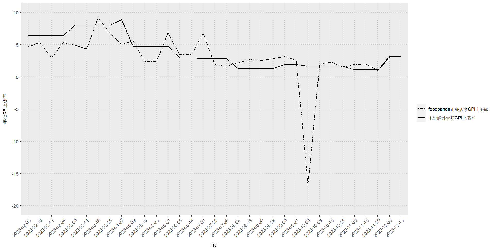

# Thesis

- [1 第一章、緒論](#第一章緒論)
- [2
  第二章、文獻回顧](#第二章文獻回顧)
- [3
  第三章、資料處理與觀察](#第三章資料處理與觀察)
  - [3.1
    第一節、資料介紹](#第一節資料介紹)
  - [3.2
    第二節、資料處理](#第二節資料處理)
  - [3.3
    第三節、資料觀察與分析](#第三節資料觀察與分析)
- [4
  第四章、外食物價計算方法](#第四章外食物價計算方法)
  - [4.1
    第一節、商家權重](#第一節商家權重)
    - [4.1.1
      1.經縣市加權](#經縣市加權)
    - [4.1.2
      2.經區域類別加權](#經區域類別加權)
    - [4.1.3
      3.經營業時段加權](#經營業時段加權)
    - [4.1.4
      4.經縣市及區域類別加權](#經縣市及區域類別加權)
    - [4.1.5
      5.經縣市及營業時段加權](#經縣市及營業時段加權)
    - [4.1.6
      6.經區域類別及營業時段加權](#經區域類別及營業時段加權)
    - [4.1.7
      7.經縣市、區域類別及營業時段加權](#經縣市區域類別及營業時段加權)
  - [4.2
    第二節、加入消費者權重](#第二節加入消費者權重)
    - [4.2.1
      1.評論數加權](#評論數加權)
- [5
  第五章、外食物價指數的應用](#第五章外食物價指數的應用)
- [6 第六章、結論](#第六章結論)

# 第一章、緒論

根據主計處網站，消費者物價指數的編製目的為衡量臺灣地區家庭購買消費性商品及服務之價格水準變動情形，可以用來評估通貨膨脹的狀況，並作為薪資調整的參考、稅負徵收的依據。主計處除了編算總指數外，又下分食物類、衣著類、居住類、交通及通訊類、醫療保健類、教養娛樂類及雜項類等7個大類、40
個中類及 62
個小類之分類指數，查價項目涵蓋了368個項目群。依據110年基期消費者物價指數查價項目之權數，7大類中的權數分別為食物類267.53‰、衣著類55.25‰、居住類227.71‰、交通及通訊類144.71‰、醫療保健類47.37‰、教養娛樂類132.46‰、雜項類124.97‰，當中又有食物類的比重最高，食物類的比重最高，因為飲食是人們日常生活中必不可少的支出項目，因此食物價格的變動對民眾的生活影響甚鉅。

然而，儘管消費者物價指數提供了重要的參考資訊，每月的消費者物價指數皆在次月五日後由主計處發布，可能無法及時了解市場的變化。隨著新冠疫情爆發與人們消費習慣的改變，帶動了外送平台的興起，根據資策會產業情報研究所（MIC）發布外送平台大調查顯示，2023年民眾最常用的外送平台為foodpanda，有將近73.6%的民眾使用過平台。這顯示了foodpanda在台灣的重要性，不僅提供了便捷的外送服務，更成為了民眾日常生活中不可或缺的購買外食管道。因此，本文將利用foodpanda上的價格資料計算物價變化，並以不同面向切入計算權數，以此與主計處的計算方法有所不同，旨在建立一個更具代表性的外食物價指數。

# 第二章、文獻回顧

# 第三章、資料處理與觀察

## 第一節、資料介紹

本文以主計處每月公布的外食類CPI上漲率作為基準，年化CPI上漲率=(每月CPI上漲率​/每月天數)×365。

並利用foodpanda上店家的店名、店家菜單品項與價格、店家熱門商品、店家所在縣市、店家類別、供餐時段及評論數來進行各面向的分析，涵蓋的日期包含2023年2月3日、2023年2月10日、2023年2月17日、2023年2月24日、2023年3月4日、2023年3月11日、2023年3月18日、2023年3月25日、2023年4月27日、2023年5月9日、2023年5月16日、2023年5月23日、2023年5月31日、2023年6月5日、2023年6月14日、2023年7月1日、2023年7月22日、2023年7月26日、2023年8月6日、2023年8月13日、2023年8月20日、2023年8月28日、2023年9月4日、2023年9月21日、2023年10月4日、2023年10月8日、2023年10月15日、2023年10月25日、2023年11月8日、2023年11月15日、2023年11月29日、2023年12月6日、2023年12月13日，總共33天的資料。

## 第二節、資料處理

由於店家的菜單並非所有品項都是消費者常購買的，因此本文在2023年8月6日特別抓取各店家統計出的六項熱門商品，目的在於架構餐飲CPI時能更具代表性。同時以2023年8月6日這天為基準期，各期篩選出來的店家須符合下列兩項原則：1.店家在不僅在當期存在，基準期也存在。2.店家菜單在當期有基準期的6項人氣精選商品，且下一期也有基準期的6項人氣商品。除了各期符合兩項原則的店家以外，進一步再篩選出只銷售正餐的店家，剔除只賣點心、飲料的店家，因為主要影響民生餐飲成本的還是販售正餐的店家。

## 第三節、資料觀察與分析

根據foodapnda上的店家，首先計算每一期六項人氣精選商品的價格加總，而個別店家當期的CPI上漲率=ln(下一期價格)-ln(當期價格)，再將當期所有店家的CPI上漲率取平均得到當期的CPI上漲率。而因為每一期間隔的天數不同，利用(當期的CPI上漲率/間隔天數)\*365得到年均CPI上漲率。

| 日期           | CPI上漲率 | 間隔天數 | 日均CPI上漲率 | 年均CPI上漲率 |
|:---------------|:----------|---------:|:--------------|:--------------|
| 2023年2月3日   | 0.0873%   |        7 | 0.0125%       | 4.5534%       |
| 2023年2月10日  | 0.1039%   |        7 | 0.0148%       | 5.4198%       |
| 2023年2月17日  | 0.0540%   |        7 | 0.0077%       | 2.8182%       |
| 2023年2月24日  | 0.1191%   |        8 | 0.0149%       | 5.4343%       |
| 2023年3月4日   | 0.0964%   |        7 | 0.0138%       | 5.0244%       |
| 2023年3月11日  | 0.0838%   |        7 | 0.0120%       | 4.3692%       |
| 2023年3月18日  | 0.1752%   |        7 | 0.0250%       | 9.1376%       |
| 2023年3月25日  | 0.6129%   |       33 | 0.0186%       | 6.7790%       |
| 2023年4月27日  | 0.1675%   |       12 | 0.0140%       | 5.0935%       |
| 2023年5月9日   | 0.1056%   |        7 | 0.0151%       | 5.5066%       |
| 2023年5月16日  | 0.0464%   |        7 | 0.0066%       | 2.4202%       |
| 2023年5月23日  | 0.0533%   |        8 | 0.0067%       | 2.4297%       |
| 2023年5月31日  | 0.0946%   |        5 | 0.0189%       | 6.9063%       |
| 2023年6月5日   | 0.0853%   |        9 | 0.0095%       | 3.4614%       |
| 2023年6月14日  | 0.1622%   |       17 | 0.0095%       | 3.4823%       |
| 2023年7月1日   | 0.3886%   |       21 | 0.0185%       | 6.7539%       |
| 2023年7月22日  | 0.0217%   |        4 | 0.0054%       | 1.9778%       |
| 2023年7月26日  | 0.0497%   |       11 | 0.0045%       | 1.6489%       |
| 2023年8月6日   | 0.0417%   |        7 | 0.0060%       | 2.1725%       |
| 2023年8月13日  | 0.0451%   |        7 | 0.0064%       | 2.3541%       |
| 2023年8月20日  | 0.0542%   |        8 | 0.0068%       | 2.4733%       |
| 2023年8月28日  | 0.0390%   |        7 | 0.0056%       | 2.0312%       |
| 2023年9月4日   | 0.1370%   |       17 | 0.0081%       | 2.9420%       |
| 2023年9月21日  | 0.0920%   |       13 | 0.0071%       | 2.5844%       |
| 2023年10月4日  | -0.1842%  |        4 | -0.0461%      | -16.8119%     |
| 2023年10月8日  | 0.0375%   |        7 | 0.0054%       | 1.9562%       |
| 2023年10月15日 | 0.0637%   |       10 | 0.0064%       | 2.3265%       |
| 2023年10月25日 | 0.0590%   |       14 | 0.0042%       | 1.5389%       |
| 2023年11月8日  | 0.0375%   |        7 | 0.0054%       | 1.9541%       |
| 2023年11月15日 | 0.0750%   |       14 | 0.0054%       | 1.9543%       |
| 2023年11月29日 | 0.0212%   |        7 | 0.0030%       | 1.1062%       |
| 2023年12月6日  | 0.0564%   |        7 | 0.0081%       | 2.9393%       |

比較主計處公布的外食類CPI上漲率與foodpanda平台上正餐店家CPI上漲率，從圖中可以觀察到，主計處的外食類CPI上漲率的最高點落在2023年的3月及4月，年均CPI上漲率分別為8.16%和8.76%，之後逐漸趨於平緩。然而，foodpanda的正餐店家CPI上漲率則有較大的波動，尤其在2023年10月4日出現了一個顯著的下跌，甚至出現-16.8119%的負值。這種差異可能反映出foodpanda平台上的餐飲價格變動與整體市場趨勢之間存在著差異，平台上特定時段內的促銷活動可能為主因。例如，foodpanda在特定時期內提供了額外的折扣或優惠，導致其平台上的餐廳CPI上漲率低於主計處公布的資料。

# 第四章、外食物價計算方法

## 第一節、商家權重

### 1.經縣市加權

為了解決樣本偏誤的問題，將在各期進行權重的調整，以還原2023年8月6日總共56545間店家的母體結構。根據2023年8月6日的縣市母體分配，台中市15.54%、新北市14.91%、高雄市12.16%、台北市11.05%、桃園市10.43%、台南市8.25%、彰化縣4.76%、屏東縣2.90%、新竹縣2.58%、新竹市2.54%、宜蘭縣2.44%、雲林縣2.18%、嘉義市2.14%、苗栗縣2%、南投縣1.67%、花蓮縣1.63%、基隆市1.47%、嘉義縣0.76%及台東縣0.59%。

下表為各期店家所在縣市的占比，首先將根據店家所在的縣市進行加權處理，以確保每個縣市的樣本在分析中得到適當的代表性。

各期各店家權數=縣市母體分配/各期縣市樣本分配

| 日期       | 經縣市加權CPI上漲率 | 間隔天數 | 日均CPI上漲率 | 年均CPI上漲率 |
|:-----------|--------------------:|---------:|--------------:|--------------:|
| 2023-02-03 |           0.0873251 |        7 |     0.0124750 |      4.553378 |
| 2023-02-10 |           0.1039406 |        7 |     0.0148487 |      5.419762 |
| 2023-02-17 |           0.0540479 |        7 |     0.0077211 |      2.818211 |
| 2023-02-24 |           0.1191079 |        8 |     0.0148885 |      5.434296 |
| 2023-03-04 |           0.0963583 |        7 |     0.0137655 |      5.024400 |
| 2023-03-11 |           0.0837936 |        7 |     0.0119705 |      4.369237 |
| 2023-03-18 |           0.1752422 |        7 |     0.0250346 |      9.137628 |
| 2023-03-25 |           0.6128938 |       33 |     0.0185725 |      6.778976 |
| 2023-04-27 |           0.1674571 |       12 |     0.0139548 |      5.093488 |
| 2023-05-09 |           0.1056056 |        7 |     0.0150865 |      5.506580 |
| 2023-05-16 |           0.0464152 |        7 |     0.0066307 |      2.420220 |
| 2023-05-23 |           0.0532542 |        8 |     0.0066568 |      2.429721 |
| 2023-05-31 |           0.0946075 |        5 |     0.0189215 |      6.906345 |
| 2023-06-05 |           0.0853494 |        9 |     0.0094833 |      3.461394 |
| 2023-06-14 |           0.1621881 |       17 |     0.0095405 |      3.482274 |
| 2023-07-01 |           0.3885797 |       21 |     0.0185038 |      6.753886 |
| 2023-07-22 |           0.0216748 |        4 |     0.0054187 |      1.977829 |
| 2023-07-26 |           0.0496927 |       11 |     0.0045175 |      1.648895 |
| 2023-08-06 |           0.0416637 |        7 |     0.0059520 |      2.172464 |
| 2023-08-13 |           0.0451468 |        7 |     0.0064495 |      2.354082 |
| 2023-08-20 |           0.0542083 |        8 |     0.0067760 |      2.473253 |
| 2023-08-28 |           0.0389549 |        7 |     0.0055650 |      2.031220 |
| 2023-09-04 |           0.1370253 |       17 |     0.0080603 |      2.942013 |
| 2023-09-21 |           0.0920476 |       13 |     0.0070806 |      2.584412 |
| 2023-10-04 |          -0.1842405 |        4 |    -0.0460601 |    -16.811943 |
| 2023-10-08 |           0.0375171 |        7 |     0.0053596 |      1.956247 |
| 2023-10-15 |           0.0637395 |       10 |     0.0063739 |      2.326491 |
| 2023-10-25 |           0.0590257 |       14 |     0.0042161 |      1.538883 |
| 2023-11-08 |           0.0374756 |        7 |     0.0053537 |      1.954085 |
| 2023-11-15 |           0.0749576 |       14 |     0.0053541 |      1.954253 |
| 2023-11-29 |           0.0212145 |        7 |     0.0030306 |      1.106185 |
| 2023-12-06 |           0.0563695 |        7 |     0.0080528 |      2.939264 |

下圖為原始資料的CPI上漲率及經縣市加權的CPI上漲率，可以看出兩者之間幾乎相當，但在2023年8月6日到2023年9月4日這段期間出現些微的差距，經縣市加權的CPI上漲率略高於原始資料的CPI上漲率，這可能表示特定縣市的物價變化會對整體CPI產生影響。

### 2.經區域類別加權

在foodpanda平台上，店家可以自行選擇其販售商品的類別。而此處將類別細分為區域性和非區域性兩大類．區域性類別涵蓋中式、日式、台式、東南亞、異國、港式、歐美及韓式，但當店家並未選擇任何區域性類別，或同時選擇了多個區域性類別時，將其統一歸類為「無區域類」，以確保每個店家僅對應一種類別。

### 3.經營業時段加權

### 4.經縣市及區域類別加權

### 5.經縣市及營業時段加權

### 6.經區域類別及營業時段加權

### 7.經縣市、區域類別及營業時段加權

## 第二節、加入消費者權重

### 1.評論數加權

# 第五章、外食物價指數的應用

# 第六章、結論
