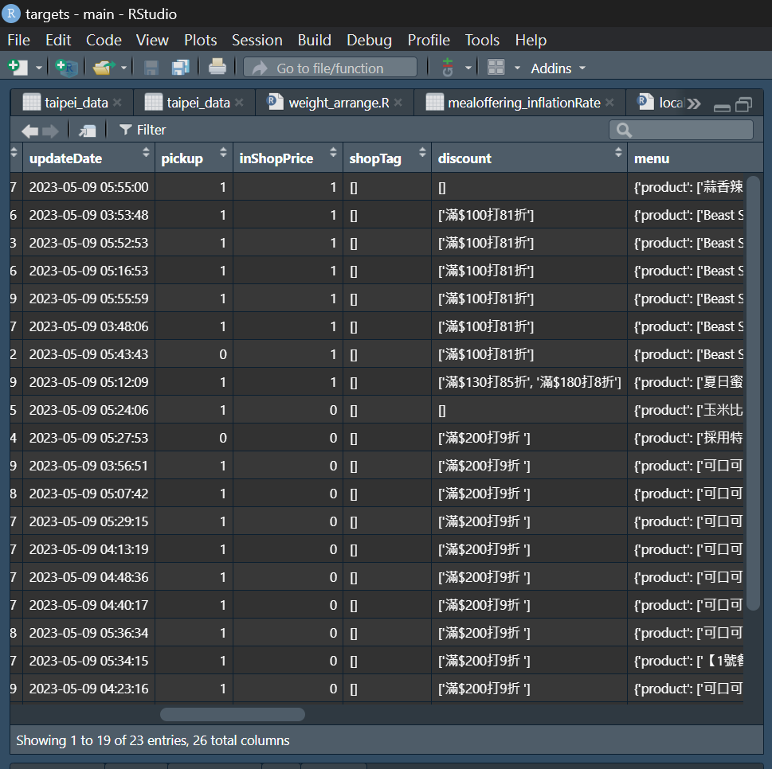
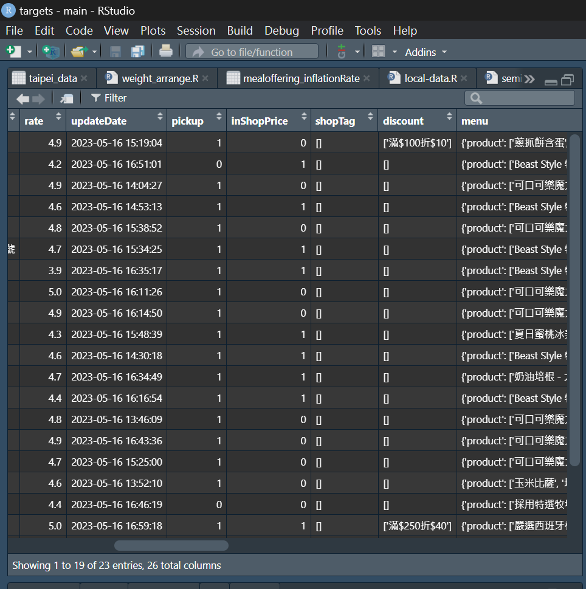
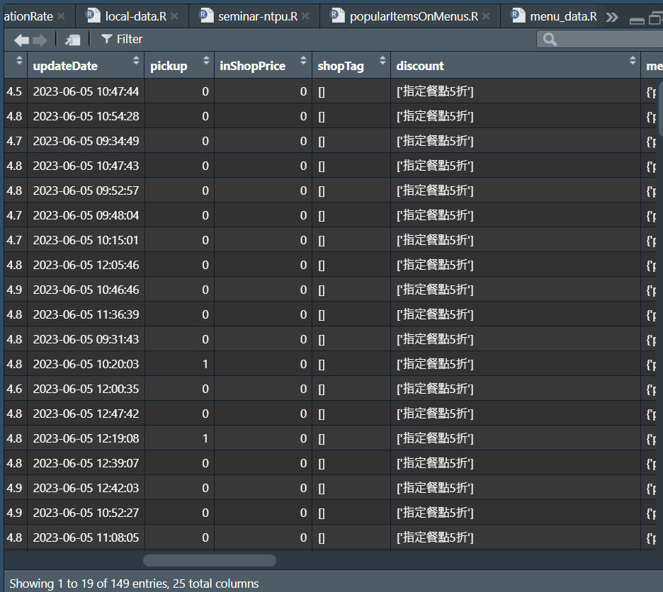
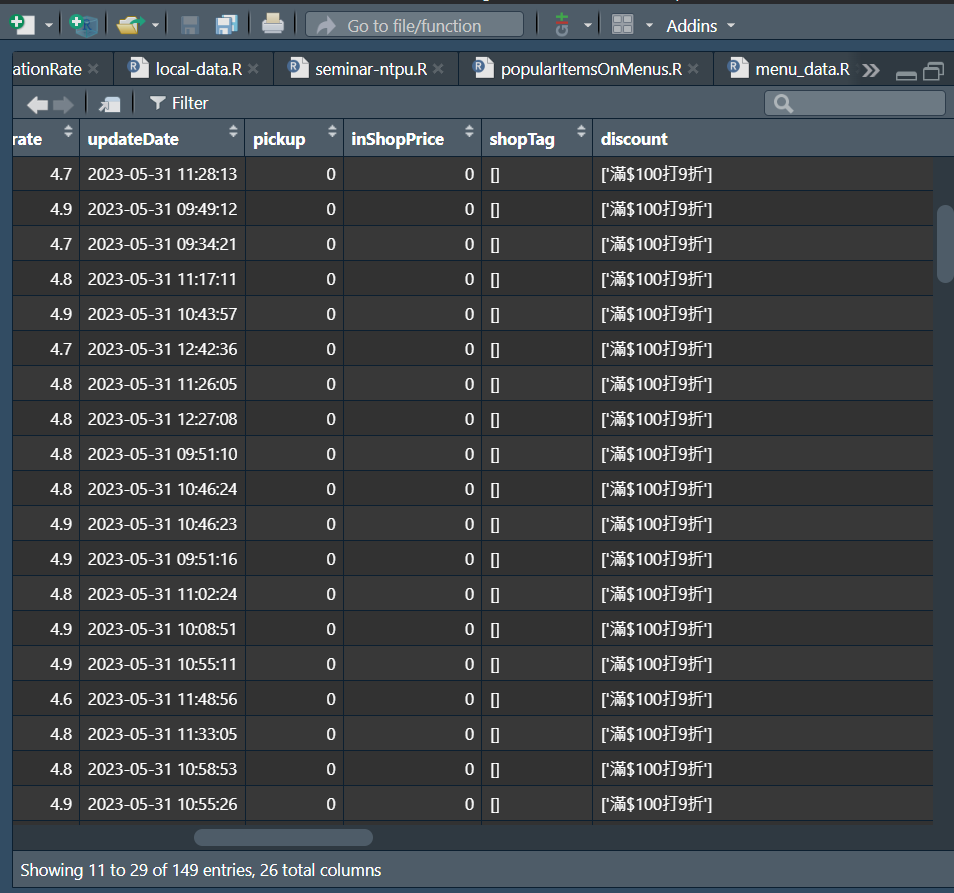

```{r setup, include=FALSE}
knitr::opts_chunk$set(echo = TRUE)
```

## 歐美類型店家出現四個波段

### 5/9到5/16期間有著16.39%的漲幅

- 5/9有1909間歐美類型店家，占總樣本數19442間店家的10%左右。
- 而1909間歐美店家，當中有67間(3.5%)inflation大於0
- 檢查這兩天上漲店家的共同點，發現有6間MrBeastBurger美式漢堡‧薯條JK廚房(上漲率為21.07%)以及11間胖老爹(上漲率為10.54%)。前者有滿100元打81折的活動，後者有滿200元打9折的活動。而在5/16即恢復原價。
期間的上漲率為0.3144%，年化後16.39%
```{r,echo=FALSE,out.width="1000px"}


```


### 5/31到6月5日期間有著29.59%的漲幅

- 5/31有2599間歐美類型店家，占總樣本數24261間店家的10.71%左右。
- 而2599間歐美店家，當中有149間(占歐美店家5.7%)inflation大於0
- 檢查這兩天上漲店家的共同點，發現有115間為晨間廚房(上漲率為10.54%)。在5/31日有滿$100打9折的活動，6月5日變為只有指定餐點打五折的活動（但看菜單價格皆為原價）。
- 期間的上漲率為0.4052%，年化後29.59%


```{r,echo=FALSE,out.width="1000px"}


```

### 7/26至8月6日期間有著-12.79%的跌幅
- 7/26有2761間歐美類型店家，占總樣本數25079間店家的11%左右。
- 而2761間歐美店家，當中有77間(2.79%)inflation小於0
- 檢查這兩天下跌店家的共同點，發現有57間為路易莎(CPI上漲率-12.78%)。在7/26日無優惠活動，8月6日則有滿$250打88折。
- 在這期間的上漲率為-0.3853%，年化後-12.79%

### 8/28至9月4日有17.84的漲幅
- 8/28有1382間歐美類型店家，占總樣本數12361間店家的11.18%左右。
- 而1382間歐美店家，當中有32間(2.31%)inflation大於0
- 檢查上漲的店家，發現有19間為路易莎(上漲率為12.78%)。在8/28日有滿250元打88折的活動，9月4日則恢復原價。
- 在這期間的上漲率為0.3421%，年化後17.83%
